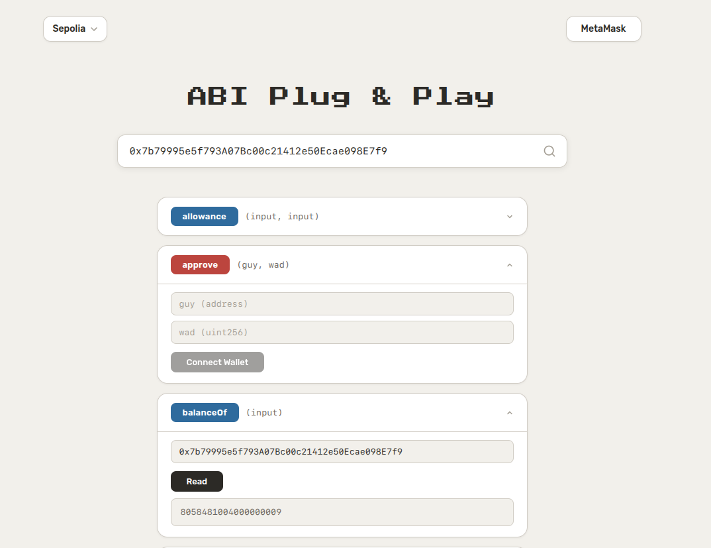
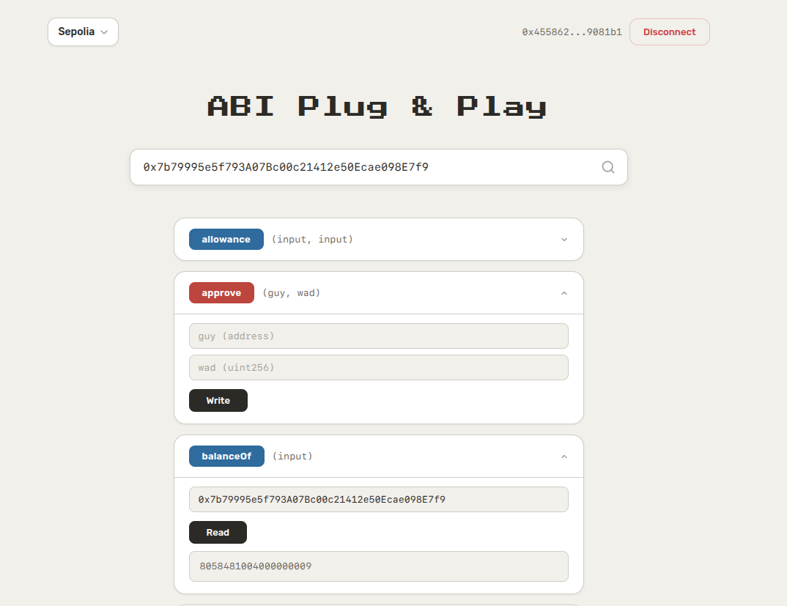

# ABI Plug & Play

A lightweight smart contract interaction tool. Paste any verified contract address, select a chain, and read or write to its functions directly from the browserd.

---

## Features

- **Auto ABI fetching** — fetches verified ABI from Etherscan automatically
- **Read functions** — call view/pure functions without connecting a wallet
- **Write functions** — send transactions via connected wallet
- **Multi-chain** — Ethereum, Sepolia, Optimism, Arbitrum, Polygon, BSC, opBNB and their testnets
- **EOA & unverified contract detection** — validates the address is a verified contract before fetching

---

## Screenshots

<table>
  <tr>
    <td align="center"><b>Disconnected</b></td>
    <td align="center"><b>Connected</b></td>
  </tr>
  <tr>
    <td></td>
    <td></td>
  </tr>
</table>

---

## Upcoming

- **Manual ABI input** — paste a raw ABI for unverified contracts
- **Complex input types** — structured input fields for tuples, structs, and nested arrays
- **Complex output rendering** — formatted display for struct and tuple return values

---

## Stack

| Layer | Tech |
|-------|------|
| Client | React, TypeScript, Wagmi, Viem, TanStack Query |
| Server | Node.js, Express, TypeScript, Viem |

---

## Running Locally

```bash
# install & run server
cd server && npm install && npm run dev

# install & run client (separate terminal)
cd client && npm install && npm run dev
```

**`server/.env`**

```
PORT=
ETHERSCAN_SECRET_KEY=
```
