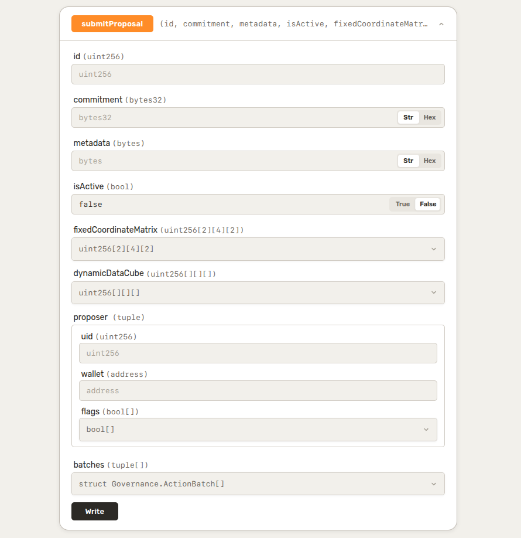
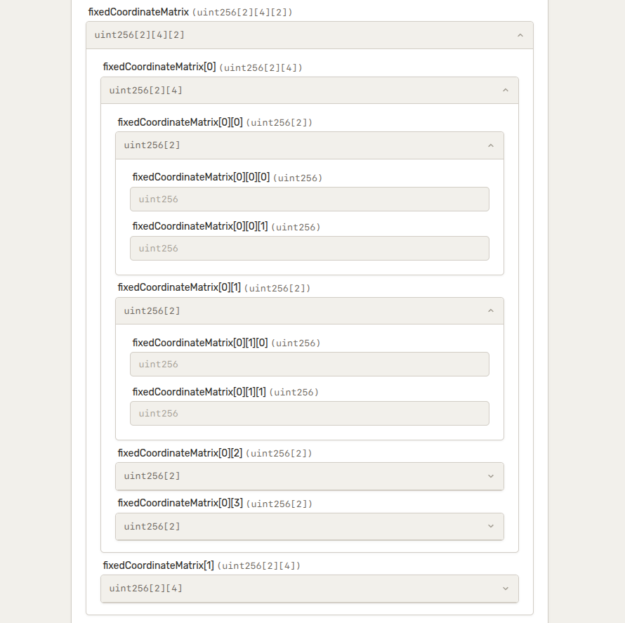
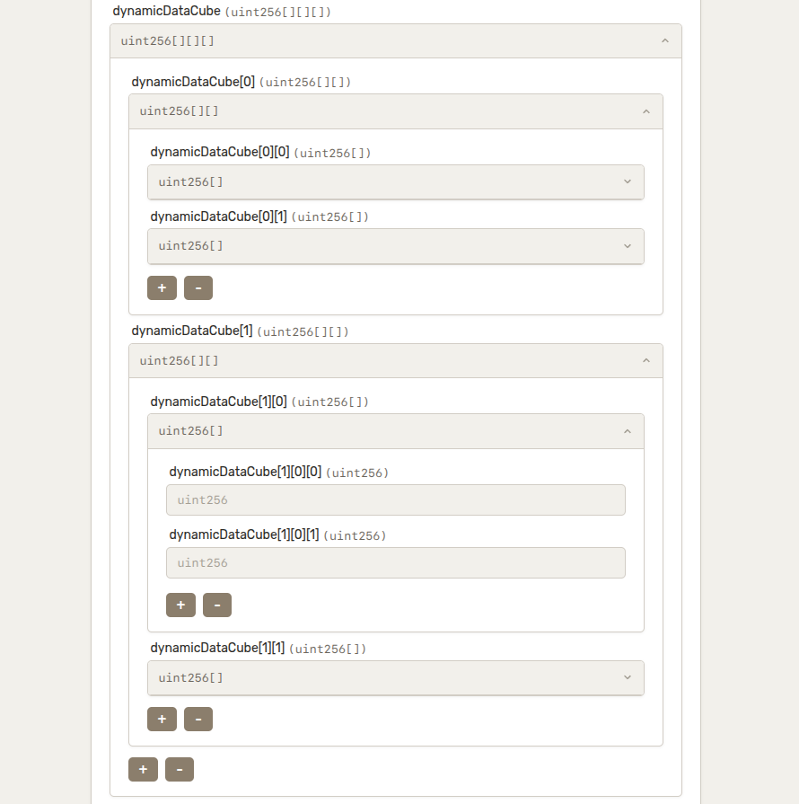
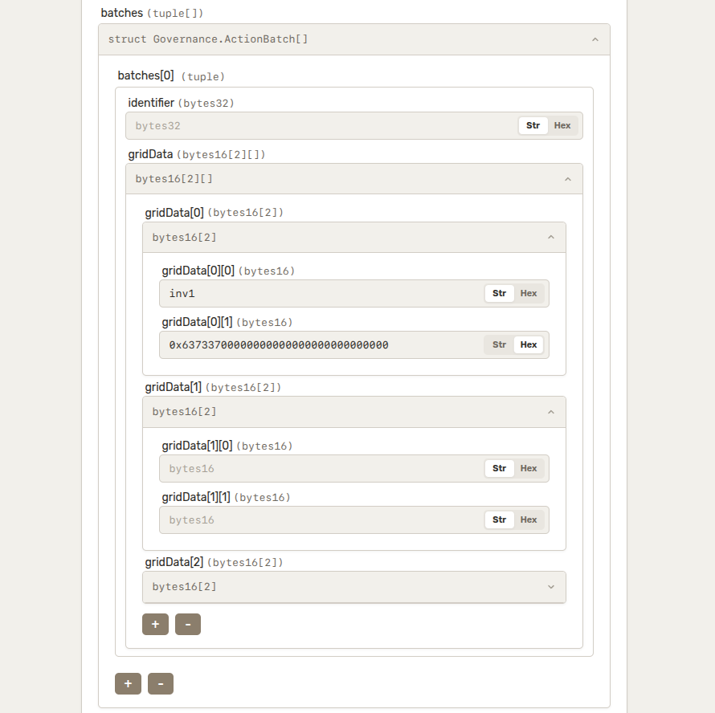

# ABI Plug & Play

A lightweight smart contract interaction tool. Paste any verified contract address, select a chain, and read or write to its functions directly from the browserd.


## Features

- **Auto ABI fetching** — fetches verified ABI from Etherscan automatically
- **Read functions** — call view/pure functions without connecting a wallet
- **Write functions** — send transactions via connected wallet
- **Payable functions** — specify value in ETH or Wei for payable functions
- **Multi-chain** — Ethereum, Sepolia, Optimism, Arbitrum, Polygon, BSC, opBNB and their testnets
- **EOA & unverified contract detection** — validates the address is a verified contract before fetching
- **Handle complex types** — supports arrays, tuples, structs, and nested inputs

## Preview

<table>
  <tr>
    <td align="center"><b>Disconnected</b></td>
    <td align="center"><b>Connected</b></td>
  </tr>
  <tr>
    <td></td>
    <td></td>
  </tr>
</table>

### Complex Types Handling

<table>
  <tr>
    <td align="center"><b>Types Overview</b></td>
    <td align="center"><b>Nested Arrays (Fixed)</b></td>
  </tr>
  <tr>
    <td></td>
    <td></td>
  </tr>
  <tr>
    <td align="center"><b>Nested Arrays (Dynamic)</b></td>
    <td align="center"><b>Tuples</b></td>
  </tr>
  <tr>
    <td></td>
    <td></td>
  </tr>
</table>


## Upcoming

- **Manual ABI input** — paste a raw ABI for unverified contracts
- **Complex output rendering** — formatted display for struct and tuple return values


## Stack

| Layer | Tech |
|-------|------|
| Client | React, TypeScript, Wagmi, Viem, TanStack Query |
| Server | Node.js, Express, TypeScript, Viem |


## Running Locally

```bash
# install & run server
cd server && pnpm install && pnpm run dev

# install & run client (separate terminal)
cd client && pnpm install && pnpm run dev
```

**`server/.env`**

```
PORT=
ETHERSCAN_SECRET_KEY=
```
