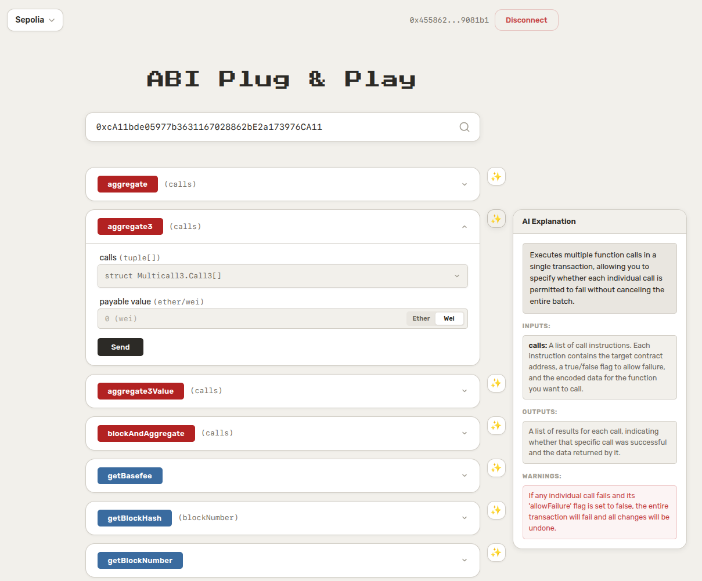

<div align="center">
  <h1> ABI Plug & Play</h1>
  <p><b>A lightweight, intelligent smart contract interaction tool.</b></p>
  <p>Paste any verified contract address, select a chain, and interact with its functions directly from the browser.</p>
</div>

---

## Features

- **Auto ABI Fetching** — Fetches verified ABIs from block explorers automatically.
- **AI Function Explanations** — Understand complex transactions instantly. AI describes function purpose, inputs, outputs, and adds warnings for potential pitfalls like reentrancy.
- **Read & Write** — Call view/pure functions without connecting a wallet, or send transactions via your connected wallet.
- **Payable Support** — Specify value in ETH or Wei for payable functions.
- **Multi-Chain** — Supports Ethereum, Sepolia, Optimism, Arbitrum, Polygon, BSC, opBNB and testnets.
- **Smart Validation** — Automatically detects EOA & unverified contracts to save time.
- **Handle Complex Types** — Full support for arrays, tuples, structs, and deep nested inputs.

## Preview

### AI Function Explanation


### Interface Overview
<table>
  <tr>
    <td align="center"><b>Types Overview</b></td>
    <td align="center"><b>Nested Arrays (Fixed)</b></td>
  </tr>
  <tr>
    <td></td>
    <td></td>
  </tr>
  <tr>
    <td align="center"><b>Nested Arrays (Dynamic)</b></td>
    <td align="center"><b>Tuples</b></td>
  </tr>
  <tr>
    <td></td>
    <td></td>
  </tr>
</table>

## 🚀 Upcoming

- **Manual ABI input** — Paste a raw ABI for unverified contracts.
- **Complex output rendering** — Formatted display for struct and tuple return values.

## Stack

| Layer    | Tech Stack                                     |
| -------- | ---------------------------------------------- |
| **Client** | React, TypeScript, Wagmi, Viem, TanStack Query |
| **Server** | Node.js, Express, TypeScript, Viem             |

## Running Locally

```bash
# install & run server
cd apps/server && pnpm install && pnpm run dev

# install & run client (separate terminal)
cd apps/client && pnpm install && pnpm run dev
```

