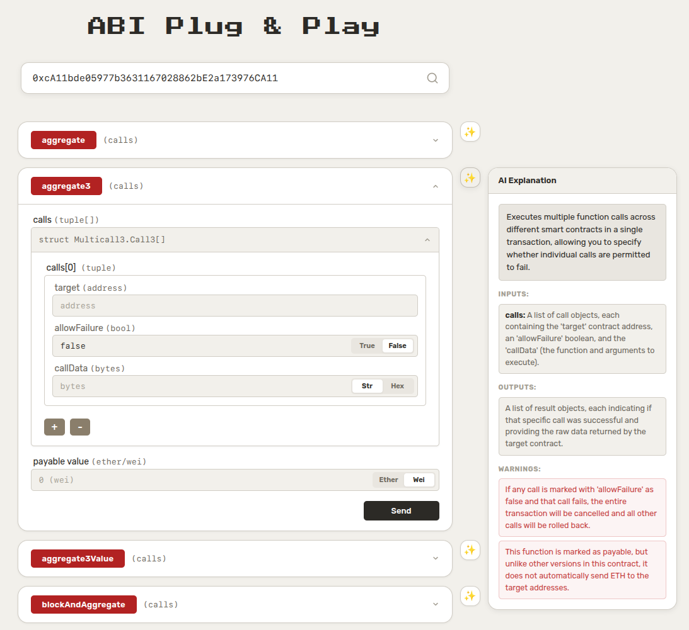
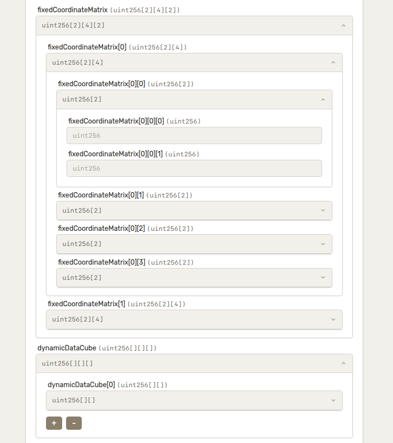
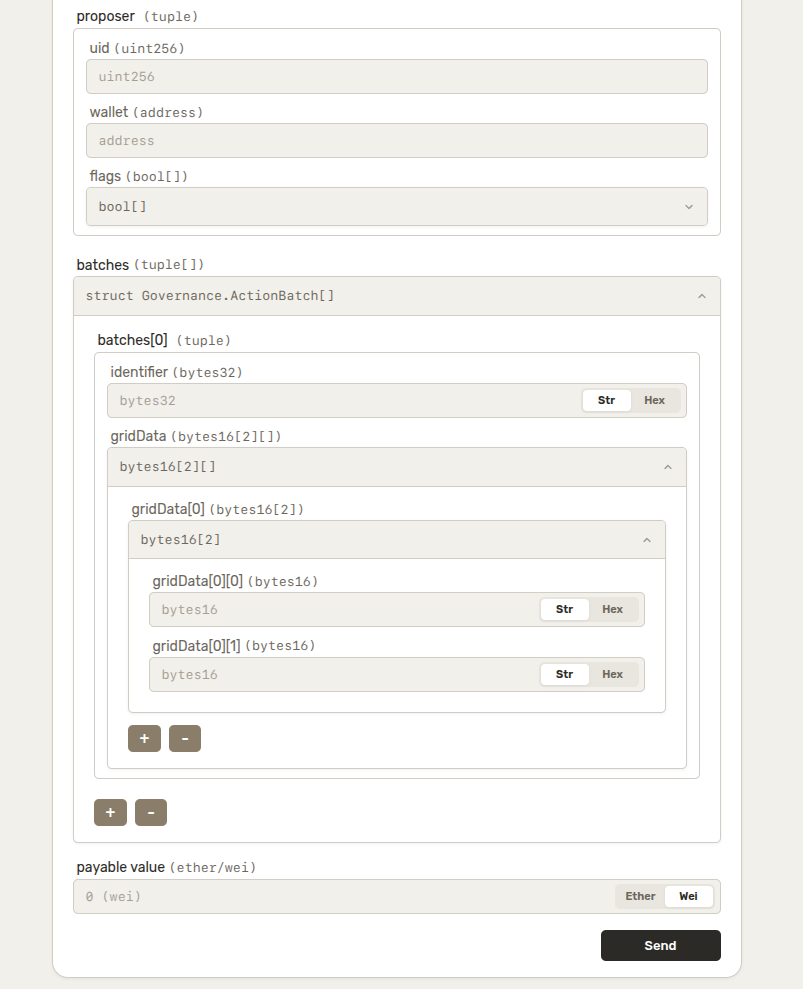
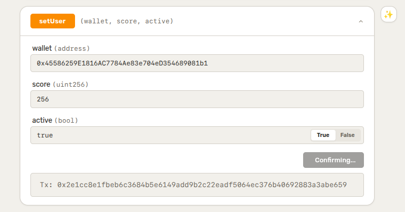
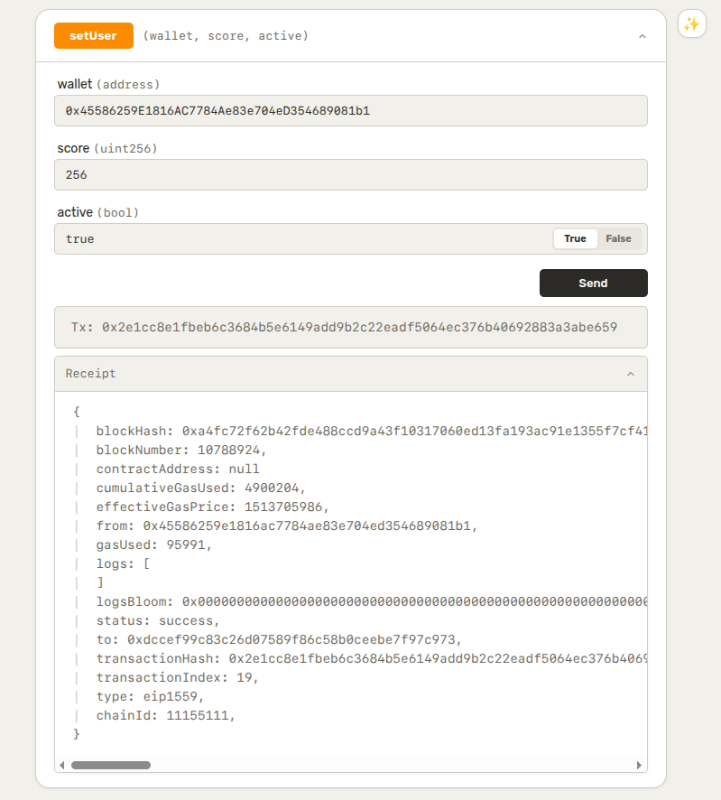

<div align="center">
  <h1> ABI Plug & Play</h1>
  <p><b>A lightweight, intelligent smart contract interaction tool.</b></p>
  <p>Paste any verified contract address, select a chain, and interact with its functions directly from the browser.</p>
</div>

---

## Features

- **Auto ABI Fetching** — Fetches verified ABIs from block explorers automatically.
- **AI Function Explanations** — AI explains function purpose, inputs, outputs, and adds warnings for potential pitfalls like reentrancy.
- **Read & Write** — Call view/pure functions without connecting a wallet, or send transactions via your connected wallet.
- **Payable Support** — Specify value in ETH or Wei for payable functions.
- **Multi-Chain** — Supports Ethereum, Sepolia, Optimism, Arbitrum, Polygon, BSC, opBNB and testnets.
- **Smart Validation** — Automatically detects EOA & unverified contracts to save time.
- **Handle Complex IO Types** — Full support for deeply nested inputs alongside elegantly formatted structs, tuples, and nested output displays!
- **Instant TX Feedback** — Real-time tracking of pending transactions and detailed transaction receipts directly in the interface.

## Preview

### AI Function Explanation



### Interface Overview

<table>
  <hr/>
  <tr>
    <td></td>
    <td></td>
  </tr>
</table>

### Transaction Execution & Receipts

<table>
  <hr/>
  <tr>
    <th>Pending Confirmation</th>
    <th>Transaction Confirmed</th>
  </tr>
  <tr>
    <td></td>
    <td></td>
  </tr>
</table>

## 🚀 Upcoming Roadmap

### Core Product Upgrades

- **Manual ABI input** — Paste a raw ABI for unverified contracts.
- **Embedded Mini-LLM** — Replace external Gemini API dependency with an in-app mini-LLM flow for function explanations.
- **Developer receipt detail toggle** — Add a dev-mode switch to choose between full transaction receipts and logs-only output.

### Transaction UX Improvements

- **Etherscan deep links on transaction hash** — Make each tx hash clickable to open its transaction page on Etherscan.


## Stack

| Layer      | Tech Stack                                     |
| ---------- | ---------------------------------------------- |
| **Client** | React, TypeScript, Wagmi, Viem, TanStack Query |
| **Server** | Node.js, Express, TypeScript, Viem             |

## Running Locally

```bash
# install & run server
cd apps/server && pnpm install && pnpm run dev

# install & run client (separate terminal)
cd apps/client && pnpm install && pnpm run dev
```
